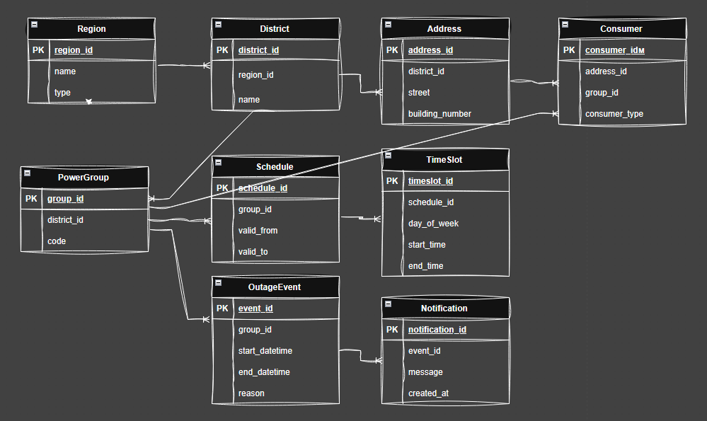

# Проектування бази даних «Графіки відключення електроенергії»

## Мета системи
Система призначена для зберігання та керування графіками планових відключень
електроенергії для міста Київ та Київської області з урахуванням територіального
поділу та груп споживачів.

## Зацікавлені сторони
Оператори електромереж — формують графіки для міста та області

Мешканці Києва — переглядають графіки за районом і чергою

Мешканці області — переглядають загальні графіки області

Адміністратори системи — забезпечують актуальність даних

## Дані для зберігання
регіони (місто Київ, Київська область)

райони міста

населені пункти області

черги споживачів

типи графіків

періоди дії графіків

записи відключень

## Бізнес-правила
Графіки для міста Київ та Київської області зберігаються окремо

Для Київської області діє єдиний графік незалежно від населеного пункту

Місто Київ поділяється на райони

Черги належать до конкретної території

Графік може містити кілька інтервалів відключення

## ER діаграма

## Сутності та їх атрибути

### Region
Представляє адміністративну одиницю (місто або область).

**Атрибути:**
- `region_id` (PK) — унікальний ідентифікатор регіону
- `name` — назва регіону (наприклад, Київ, Київська область)
- `type` — тип регіону (`city`, `region`)

**Звʼязки:**
- Один регіон може містити багато районів (1:N з District)

---

### District
Адміністративний район у межах регіону.

**Атрибути:**
- `district_id` (PK) — унікальний ідентифікатор району
- `region_id` (FK) — посилання на регіон
- `name` — назва району

**Звʼязки:**
- Район належить одному регіону
- Район містить багато адрес
- Район містить багато груп відключень

---

### Address
Фізична адреса споживача.

**Атрибути:**
- `address_id` (PK) — унікальний ідентифікатор адреси
- `district_id` (FK) — район, у якому знаходиться адреса
- `street` — назва вулиці
- `building_number` — номер будинку

**Звʼязки:**
- Адреса належить одному району
- За однією адресою може бути кілька споживачів

---

### PowerGroup
Група (черга) відключення електроенергії.

**Атрибути:**
- `group_id` (PK) — унікальний ідентифікатор групи
- `district_id` (FK) — район, у якому діє група
- `code` — умовне позначення групи (наприклад, Група 1)

**Звʼязки:**
- Група належить одному району
- Група має кілька графіків
- Група обслуговує багато споживачів
- Група може мати багато подій відключень

---

### Schedule
Графік відключень для групи на певний період.

**Атрибути:**
- `schedule_id` (PK) — унікальний ідентифікатор графіка
- `group_id` (FK) — група відключень
- `valid_from` — дата початку дії графіка
- `valid_to` — дата завершення дії графіка

**Звʼязки:**
- Один графік належить одній групі
- Один графік містить кілька часових інтервалів

---

### TimeSlot
Часовий інтервал відключення в межах графіка.

**Атрибути:**
- `timeslot_id` (PK) — унікальний ідентифікатор інтервалу
- `schedule_id` (FK) — графік
- `day_of_week` — день тижня
- `start_time` — час початку відключення
- `end_time` — час завершення відключення

**Звʼязки:**
- Інтервал належить одному графіку

---

### Consumer
Кінцевий споживач електроенергії.

**Атрибути:**
- `consumer_id` (PK) — унікальний ідентифікатор споживача
- `address_id` (FK) — адреса споживача
- `group_id` (FK) — група відключення
- `consumer_type` — тип споживача (житловий, бізнес, критична інфраструктура)

**Звʼязки:**
- Споживач має одну адресу
- Споживач належить до однієї групи відключення

---

### OutageEvent
Фактична подія відключення електроенергії.

**Атрибути:**
- `event_id` (PK) — унікальний ідентифікатор події
- `group_id` (FK) — група відключення
- `start_datetime` — дата і час початку
- `end_datetime` — дата і час завершення
- `reason` — причина відключення

**Звʼязки:**
- Подія належить одній групі
- Подія може мати кілька сповіщень

---

### Notification
Сповіщення, повʼязане з подією відключення.

**Атрибути:**
- `notification_id` (PK) — унікальний ідентифікатор сповіщення
- `event_id` (FK) — подія відключення
- `message` — текст сповіщення
- `created_at` — дата і час створення

**Звʼязки:**
- Сповіщення належить одній події відключення
