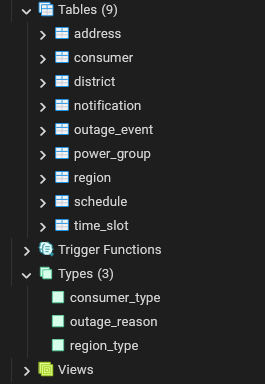
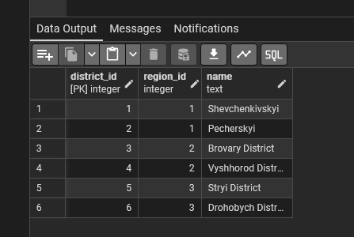

# Лабораторна робота №2
## Перетворення ER-діаграми у реляційну схему PostgreSQL

---

## 🎯 Мета роботи

Метою даної лабораторної роботи є перетворення ER-діаграми предметної області
у реляційну схему та її реалізація у СУБД PostgreSQL

---

## 📌 Опис

База даних призначена для зберігання інформації про графіки відключення
електроенергії для регіонів України (місто Київ та Київська область).

Система дозволяє:
- зберігати адміністративну ієрархію (регіон → район),
- визначати групи (черги) відключень,
- зберігати графіки та часові інтервали відключень,
- фіксувати фактичні події відключень,
- зберігати сповіщення для користувачів.

---

## Реляційна схема бази даних

- Region(`region_id`, name, type)
- District(`district_id`, `region_id`, name)
- Address(`address_id`, `district_id`, street, building_number)
- PowerGroup(`group_id`, `district_id`, code)
- Schedule(`schedule_id`, `group_id`, valid_from, valid_to)
- TimeSlot(`timeslot_id`, `schedule_id`, day_of_week, start_time, end_time)
- Consumer(`consumer_id`, `address_id`, `group_id`, consumer_type)
- OutageEvent(`event_id`, `group_id`, start_datetime, end_datetime, reason)
- Notification(`notification_id`, `event_id`, message, created_at)

---

## 🔗 Основні звʼязки між таблицями

- Один **Region** може містити багато **District**
- Один **District** може містити багато **Address** та **PowerGroup**
- Одна **PowerGroup** може мати кілька **Schedule**
- Один **Schedule** містить кілька **TimeSlot**
- Один **Consumer** належить до однієї **Address** та однієї **PowerGroup**
- Одна **PowerGroup** може мати багато **OutageEvent**
- Одна **OutageEvent** може мати кілька **Notification**

Усі звʼязки типу `1:N` реалізовані за допомогою зовнішніх ключів.

---

## 🧩 Користувацькі типи даних (ENUM)

Для підвищення цілісності даних у PostgreSQL використано перелічувані типи:

- `region_type`: `city`, `region`
- `consumer_type`: `residential`, `business`, `critical`
- `outage_reason`: `scheduled`, `maintenance`, `emergency`

---

## 🛠 Реалізація у PostgreSQL

Реалізація схеми виконана у вигляді окремих SQL-скриптів:

sql/
|--- types/
| |--- region_type.sql
| |--- consumer_type.sql
| |___ outage_reason.sql
|--- tables/
| |--- region.sql
| |--- district.sql
| |--- address.sql
| |--- power_group.sql
| |--- schedule.sql
| |--- time_slot.sql
| |--- consumer.sql
| |--- outage_event.sql
| |___ notification.sql
|___ test_data.sql

---

## 🧪 Тестування

Для перевірки коректності створення схеми було виконано:
- створення всіх типів і таблиць у PostgreSQL (Docker-контейнер)

- додавання **не менше 3 тестових записів у кожну таблицю**

- перевірка обмежень цілісності та зовнішніх ключів.

Усі SQL-скрипти виконуються без помилок.

---

## ✅ Висновки

У результаті виконання лабораторної роботи:
- ER-діаграма була успішно перетворена у реляційну схему,
- реалізовано таблиці з первинними та зовнішніми ключами,
- використано ENUM-типи для забезпечення цілісності даних,
- схема протестована на коректність у PostgreSQL.
