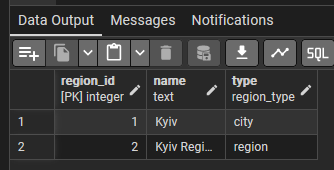
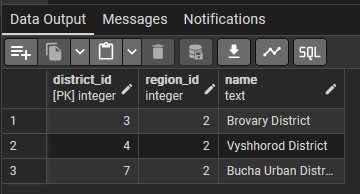
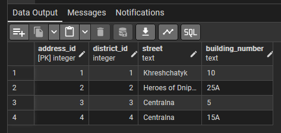
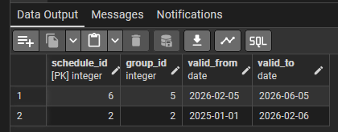

# Лабораторна робота №3

## Маніпулювання даними SQL (OLTP)

### SQL-скрипт(и)

```sql
-- Видалення зайвих районів
DELETE FROM district
WHERE region_id = 3;
```

```sql
-- Видалення зайвого регіону
DELETE FROM region
WHERE name = 'Lviv Region';
```

```sql
-- Додавання нового району
INSERT INTO district (name, region_id)
VALUES ('Bucha District', 2);
```

```sql
-- Додавання нової адреси
INSERT INTO address (street, building_number, district_id)
VALUES ('Centralna', '15A', 4);
```

```sql
-- Додавання нової групи відключень
INSERT INTO power_group (district_id, code)
VALUES (4, 'Group 4');
```

```sql
-- Додавання нового графіку відключень
INSERT INTO schedule (group_id, valid_from, valid_to) VALUES
(5, '2026-02-05', '2026-06-05');
```

```sql
-- Оновлення застарілого графіку відключень
UPDATE schedule
SET valid_to = '2026-02-06'
WHERE schedule_id = 2;
```

```sql
-- Зміна групи відключень для споживача
UPDATE consumer
SET group_id = 5
WHERE consumer_id = 3;
```

```sql
-- Оновлення назви району
UPDATE district
SET name = 'Bucha Urban District'
WHERE name = 'Bucha District'
```

```sql
-- Видалення застарілих графіків відключень
DELETE FROM time_slot
WHERE schedule_id IN (SELECT schedule_id FROM schedule WHERE valid_to < '2026-01-01');

DELETE FROM schedule
WHERE valid_to < '2026-01-01';
```

```sql
-- Отримання списку всіх регіонів
SELECT * FROM region;
```


```sql
-- Отримання всіх районів Київської області
SELECT * FROM district
WHERE region_id = 2;
```


```sql
-- Перегляд усіх адрес
SELECT * FROM address;
```


```sql
-- Перегляд усіх груп відключень
SELECT * FROM power_group;
```


```sql
-- Перегляд активних графіків відключень
SELECT * FROM schedule
WHERE valid_to >= CURRENT_DATE;
```

