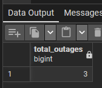
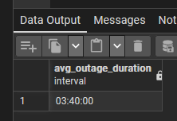
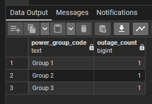
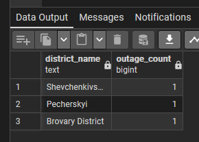
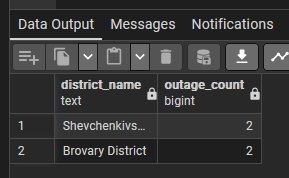
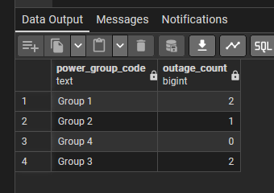
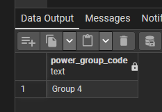
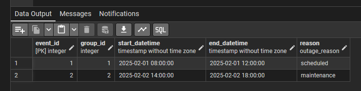
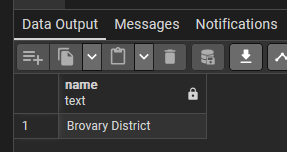
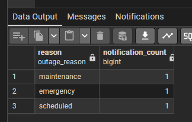

# Лабораторна робота №4

## Маніпулювання даними SQL (OLTP)

### SQL-скрипт(и)


```sql
-- 1. Підрахунок загальної кількості відключень
-- Аналіз загального навантаження на енергосистему
SELECT COUNT(*) AS total_outages
FROM outage_event;
```

```sql
-- 2. Обчислення середньої тривалості відключення
-- Дозволяє оцінити середній час відсутності електропостачання
SELECT AVG(end_datetime - start_datetime) AS avg_outage_duration
FROM outage_event;
```

```sql
-- 3. Кількість відключень для кожної групи живлення
-- Аналіз стабільності роботи окремих груп
SELECT pg.code AS power_group_code,
       COUNT(oe.event_id) AS outage_count
FROM power_group pg
JOIN outage_event oe ON oe.group_id = pg.group_id
GROUP BY pg.code;
```

```sql
-- 4. Кількість відключень по районах
-- Виявлення районів з найбільшою кількістю аварій
SELECT d.name AS district_name,
       COUNT(oe.event_id) AS outage_count
FROM district d
JOIN power_group pg ON pg.district_id = d.district_id
JOIN outage_event oe ON oe.group_id = pg.group_id
GROUP BY d.name;
```

```sql
-- additionally. Додавання фактичних відлючень для подальшого аналізу
INSERT INTO outage_event (group_id, start_datetime, end_datetime, reason)
VALUES
(1, '2025-02-15 08:00', '2025-02-15 10:00', 'scheduled'),
(3, '2025-02-20 18:00', '2025-02-20 20:00', 'emergency');
```

```sql
-- 5. Райони, де було більше одного відключення
-- Фільтрація проблемних районів за допомогою HAVING
SELECT d.name AS district_name,
       COUNT(oe.event_id) AS outage_count
FROM district d
JOIN power_group pg ON pg.district_id = d.district_id
JOIN outage_event oe ON oe.group_id = pg.group_id
GROUP BY d.name
HAVING COUNT(oe.event_id) > 1;
```

```sql
-- 6. Всі групи живлення та кількість відключень (LEFT JOIN)
-- Включає групи, де відключень не було
SELECT pg.code AS power_group_code,
       COUNT(oe.event_id) AS outage_count
FROM power_group pg
LEFT JOIN outage_event oe ON oe.group_id = pg.group_id
GROUP BY pg.code;
```

```sql
-- 7. Групи живлення без жодного відключення
-- Виявлення стабільних груп електропостачання
SELECT pg.code AS power_group_code
FROM power_group pg
LEFT JOIN outage_event oe ON oe.group_id = pg.group_id
WHERE oe.event_id IS NULL;
```

```sql
-- 8. Відключення, які тривали довше середнього значення
-- Підзапит використовується для порівняння з середнім показником
SELECT *
FROM outage_event
WHERE (end_datetime - start_datetime) >
      (SELECT AVG(end_datetime - start_datetime)
       FROM outage_event);
```

```sql
-- 9. Район з максимальною кількістю відключень
-- Підзапит використовується для пошуку найбільш проблемного району
SELECT name
FROM district
WHERE district_id = (
    SELECT pg.district_id
    FROM power_group pg
    JOIN outage_event oe ON oe.group_id = pg.group_id
    GROUP BY pg.district_id
    ORDER BY COUNT(oe.event_id) DESC
    LIMIT 1
);
```

```sql
-- 10. Кількість повідомлень за причинами відключень
-- Аналіз типів відключень та активності інформування споживачів
SELECT oe.reason,
       COUNT(n.notification_id) AS notification_count
FROM outage_event oe
JOIN notification n ON n.event_id = oe.event_id
GROUP BY oe.reason;
```
