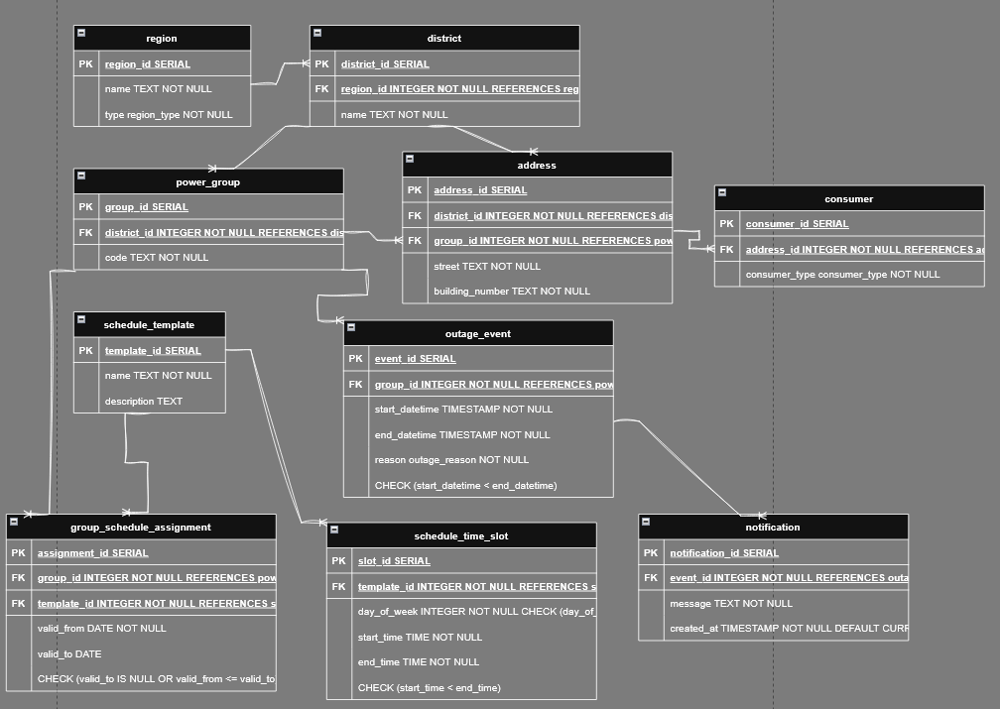

# ЗВІТ З ЛАБОРАТОРНОЇ РОБОТИ №5


## Нормалізація бази даних

У цій лабораторній роботі було проведено аналіз схеми бази даних системи управління електромережами та графіками відключень. Метою було виявлення порушень нормальних форм (зокрема транзитивних залежностей) та приведення бази даних до 3-ї нормальної форми (3NF). Також було проведено оптимізацію структури зберігання графіків для усунення надлишковості даних.

---


## 2. Функціональні Залежності Початкової Схеми


Аналіз показує, що частина таблиць вже відповідає вимогам 3NF. Однак у ключових таблицях `consumer` та `schedule` було виявлено транзитивні залежності та семантичну надлишковість.


### 2.1. Таблиці без порушень (відповідають 3NF)

**1. `region(region_id, name, type)`**
* **ПК:** `region_id`
* **ФЗ:** `region_id → name, type`


**2. `district(district_id, region_id, name)`**
* **ПК:** `district_id`
* **ФЗ:** `district_id → region_id, name`


**3. `power_group(group_id, district_id, code)`**
* **ПК:** `group_id`
* **ФЗ:** `group_id → district_id, code`


**4. `outage_event(event_id, group_id, start_datetime, end_datetime, reason)`**
* **ПК:** `event_id`
* **ФЗ:** `event_id → group_id, start_datetime, end_datetime, reason`


**5. `notification(notification_id, event_id, message, created_at)`**
* **ПК:** `notification_id`
* **ФЗ:** `notification_id → event_id, message, created_at`


### 2.2. Таблиці з виявленими порушеннями (Кандидати на нормалізацію)


**1. `consumer(consumer_id, address_id, group_id, consumer_type)`**
* **ПК:** `consumer_id`
* **ФЗ:**
    * `consumer_id → address_id`
    * `address_id → group_id`
* **Проблема (Транзитивна залежність):** Атрибут `group_id` залежить від `address_id`, а не безпосередньо від `consumer_id`. Це створює надлишковість та ризик аномалій (коли група в споживача не відповідає групі адреси).


**2. `address(address_id, district_id, street, building_number)`**
* **ПК:** `address_id`
* **ФЗ:** `address_id → district_id, street, building_number`
* **Проблема (Відсутність зв'язку):** У початковій схемі адреса не мала прямого посилання на `power_group`, що змушувало дублювати цю інформацію в `consumer`.

**3. `schedule(schedule_id, group_id, valid_from, valid_to)`**
* **ПК:** `schedule_id`
* **ФЗ:** `schedule_id → group_id, valid_from, valid_to`
* **Проблема:** Створення окремого запису розкладу для кожної групи призводить до дублювання даних, якщо групи мають однаковий графік.

**4. `time_slot(timeslot_id, schedule_id, day_of_week, start_time, end_time)`**
* **ПК:** `timeslot_id`
* **ФЗ:** `timeslot_id → schedule_id, day_of_week, start_time, end_time`
* **Проблема (Надлишковість):** Оскільки таблиця посилається на конкретний `schedule_id` (який прив'язаний до однієї групи), набір часових слотів (наприклад, "Пн 08:00-12:00") дублюється сотні разів для кожної групи. Це не є прямим порушенням 3NF (залежності від ключа вірні), але є порушенням принципів нормалізації щодо усунення надлишковості.

---


## 3. Аналіз нормальних форм та план нормалізації


### 3.1. Перша нормальна форма (1NF)
Відношення знаходиться в 1NF, якщо всі атрибути є атомарними, відсутні повторювані групи, і є первинний ключ.
**Висновок:** Усі таблиці початкової схеми мають атомарні атрибути та визначені ключі. Схема відповідає 1NF.


### 3.2. Друга нормальна форма (2NF)
**Вимога:** Жоден неключовий атрибут не повинен залежати від частини складеного ключа.
**Висновок:** Усі таблиці мають прості первинні ключі (Serial ID), тому часткові залежності відсутні. Схема відповідає 2NF.


### 3.3. Третя нормальна форма (3NF)
**Вимога:** Жоден неключовий атрибут не повинен залежати транзитивно від ключа.


**Аналіз `consumer`:**
Виявлено транзитивну залежність `consumer_id → address_id → group_id`.
**Рішення:**
1. Видалити атрибут `group_id` з таблиці `consumer`.
2. Додати атрибут `group_id` до таблиці `address`, оскільки підключення до мережі є властивістю адреси.

**Аналіз `schedule` (Оптимізація):**
**Рішення:**
1. Виділити структуру графіка в окрему сутність `schedule_template`.
2. Прив'язати часові слоти до шаблону, а не до групи.
3. Групи пов'язувати з шаблонами через таблицю `group_schedule_assignment`.

---


## 4. Команди для переходу до нормалізованої схеми (ALTER TABLE)

Нижче наведено команди, які демонструють перетворення початкової схеми у нормалізовану.

### 4.1. Зміна таблиці `address`
Додаємо посилання на технічну групу електромережі.
```sql
ALTER TABLE address
ADD COLUMN group_id INTEGER REFERENCES power_group(group_id);
```

### 4.2. Зміна таблиці `consumer`
Видаляємо надлишкове поле, оскільки група тепер визначається через адресу.
```sql
ALTER TABLE consumer
DROP COLUMN group_id;
```

### 4.3. Реструктуризація графіків (Schedule)
Оскільки структура зберігання графіків змінюється кардинально (від індивідуальних до шаблонних), використання `ALTER` є недоцільним. Старі таблиці видаляються, а нові створюються.

```sql
-- Видалення старих таблиць
DROP TABLE IF EXISTS time_slot;
DROP TABLE IF EXISTS schedule;

-- Створення нових оптимізованих таблиць
CREATE TABLE schedule_template (...);
CREATE TABLE schedule_time_slot (...);
CREATE TABLE group_schedule_assignment (...);
```

---

## 5. ER-Діаграма (Оновлена)

Нижче наведено діаграму, яка відображає нормалізовану структуру бази даних з усіма атрибутами та зв'язками.



---

## 6. Фінальний SQL DDL (Нормалізована схема — 3NF)


```sql
-- 1. Адміністративна ієрархія
CREATE TABLE region (
    region_id SERIAL PRIMARY KEY,
    name TEXT NOT NULL,
    type region_type NOT NULL -- Дозволяє розрізняти правила для Києва та області
);


CREATE TABLE district (
    district_id SERIAL PRIMARY KEY,
    region_id INTEGER NOT NULL REFERENCES region(region_id),
    name TEXT NOT NULL
);


-- 2. Ієрархія електромереж
CREATE TABLE power_group (
    group_id SERIAL PRIMARY KEY,
    district_id INTEGER NOT NULL REFERENCES district(district_id),
    code TEXT NOT NULL
);


-- 3. Адреса
-- Підтримує 3НФ шляхом розділення відповідальностей:
-- district_id: адміністративне розташування
-- group_id: технічне підключення до електромережі
CREATE TABLE address (
    address_id SERIAL PRIMARY KEY,
    district_id INTEGER NOT NULL REFERENCES district(district_id),
    group_id INTEGER NOT NULL REFERENCES power_group(group_id),
    street TEXT NOT NULL,
    building_number TEXT NOT NULL
);


-- 4. Споживач
-- Нормалізовано: поле group_id прибрано (воно зберігається в address)
CREATE TABLE consumer (
    consumer_id SERIAL PRIMARY KEY,
    address_id INTEGER NOT NULL REFERENCES address(address_id),
    consumer_type consumer_type NOT NULL
);


-- 5. Оптимізована система графіків (шаблони)
CREATE TABLE schedule_template (
    template_id SERIAL PRIMARY KEY,
    name TEXT NOT NULL,
    description TEXT
);


CREATE TABLE schedule_time_slot (
    slot_id SERIAL PRIMARY KEY,
    template_id INTEGER NOT NULL REFERENCES schedule_template(template_id),
    day_of_week INTEGER NOT NULL CHECK (day_of_week BETWEEN 1 AND 7),
    start_time TIME NOT NULL,
    end_time TIME NOT NULL,
    CHECK (start_time < end_time)
);

-- Призначає шаблон графіка групі на визначений період часу
CREATE TABLE group_schedule_assignment (
    assignment_id SERIAL PRIMARY KEY,
    group_id INTEGER NOT NULL REFERENCES power_group(group_id),
    template_id INTEGER NOT NULL REFERENCES schedule_template(template_id),
    valid_from DATE NOT NULL,
    valid_to DATE, -- NULL означає, що графік діє безстроково
    CHECK (valid_to IS NULL OR valid_from <= valid_to)
);

-- 6. Події відключень та сповіщення
CREATE TABLE outage_event (
    event_id SERIAL PRIMARY KEY,
    group_id INTEGER NOT NULL REFERENCES power_group(group_id),
    start_datetime TIMESTAMP NOT NULL,
    end_datetime TIMESTAMP NOT NULL,
    reason outage_reason NOT NULL,
    CHECK (start_datetime < end_datetime)
);

CREATE TABLE notification (
    notification_id SERIAL PRIMARY KEY,
    event_id INTEGER NOT NULL REFERENCES outage_event(event_id),
    message TEXT NOT NULL,
    created_at TIMESTAMP NOT NULL DEFAULT CURRENT_TIMESTAMP
);
```
