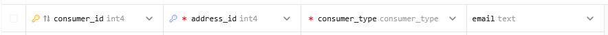
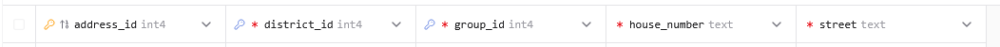
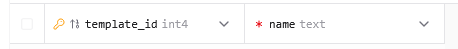
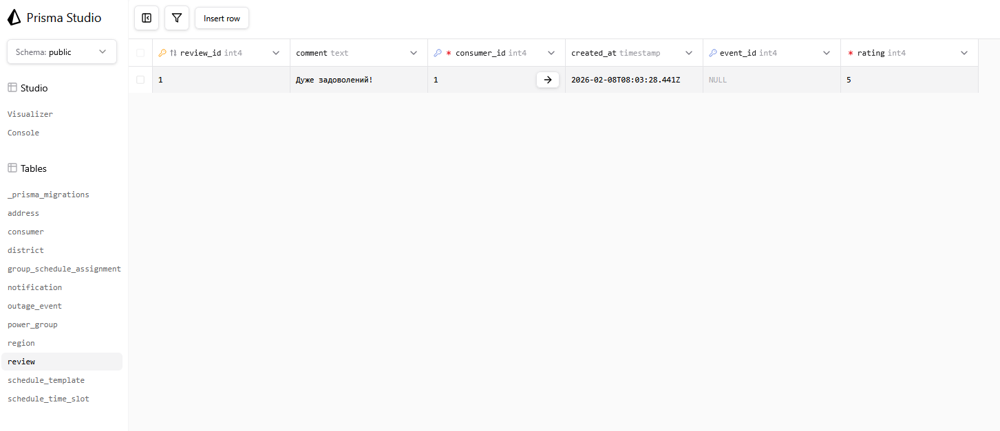

# Міграції

Цей файл документує зміни, внесені до схеми бази даних (`schema.prisma`) в рамках лабораторної роботи.

## 1. Додавання нової таблиці (Review)

**Опис:**
Створено нову модель `review` для зберігання відгуків користувачів. Встановлено зв'язки:
- Один `consumer` може мати багато `review`.
- Один `outage_event` може мати багато `review`.

**Зміни в `schema.prisma`:**

```prisma
// НОВА МОДЕЛЬ
model review {
  review_id    Int           @id @default(autoincrement())
  consumer_id  Int
  event_id     Int?
  rating       Int
  comment      String?
  created_at   DateTime      @default(now()) @db.Timestamp(6)
  consumer     consumer      @relation(fields: [consumer_id], references: [consumer_id], onDelete: Cascade, onUpdate: NoAction)
  outage_event outage_event? @relation(fields: [event_id], references: [event_id], onDelete: SetNull, onUpdate: NoAction)
}

// ОНОВЛЕННЯ ІСНУЮЧИХ МОДЕЛЕЙ
model consumer {
  // ...
  review review[] // Зворотній зв'язок
}

model outage_event {
  // ...
  review review[] // Зворотній зв'язок
}
```

---

## 2. Зміна існуючих таблиць (Додавання та Перейменування)

**Опис:**
1.  **Додавання:** У модель `consumer` додано необов'язкове поле `email`.
2.  **Перейменування:** У моделі `address` поле `building_number` змінено на `house_number` для кращої семантики.

**Зміни в `schema.prisma`:**

### Модель `consumer`

**До:**
```prisma
model consumer {
  consumer_id   Int           @id @default(autoincrement())
  address_id    Int
  consumer_type consumer_type
  // ...
}
```

**Після:**
```prisma
model consumer {
  consumer_id   Int           @id @default(autoincrement())
  address_id    Int
  email         String?       // <-- Нове поле
  consumer_type consumer_type
  // ...
}
```



### Модель `address`

**До:**
```prisma
model address {
  // ...
  street          String
  building_number String      // <-- Стара назва
  // ...
}
```

**Після:**
```prisma
model address {
  // ...
  street       String
  house_number String       // <-- Нова назва
  // ...
}
```



Зміна реалізована через Prisma migrate dev, що автоматично створює SQL ALTER TABLE.

---

## 3. Видалення стовпця

**Опис:**
Видалено поле `description` з моделі `schedule_template` для оптимізації структури, оскільки детальний опис шаблону більше не потрібен у цій таблиці.

**Зміни в `schema.prisma`:**

**До:**
```prisma
model schedule_template {
  template_id               Int                         @id @default(autoincrement())
  name                      String
  description               String?                     // <-- Поле для видалення
  group_schedule_assignment group_schedule_assignment[]
  schedule_time_slot        schedule_time_slot[]
}
```

**Після:**
```prisma
model schedule_template {
  template_id               Int                         @id @default(autoincrement())
  name                      String
  // Поле description видалено
  group_schedule_assignment group_schedule_assignment[]
  schedule_time_slot        schedule_time_slot[]
}
```



---

## 4. Перевірка роботи схеми

Для перевірки коректності змін у базі даних було написано скрипт на Node.js, який підключається до бази даних PostgreSQL, створює тестові дані (споживача та відгук) та зчитує їх.

**Результат виконання тесту:**

```text
--- Підключення до бази даних (PostgreSQL) ---
--- Перевірка існування таблиці review ---
Таблиця review існує: true

--- Очистка таблиці review перед тестом ---
--- Вставка даних у review ---
Споживача не знайдено. Створюємо нового...
Створено нового споживача з ID: 1
Вставлено запис: {
  review_id: 1,
  consumer_id: 1,
  event_id: null,
  rating: 5,
  comment: 'Дуже задоволений!',
  created_at: 2026-02-08T08:03:28.441Z
}

--- Читання даних з review ---
Знайдено записів: [
  {
    review_id: 1,
    consumer_id: 1,
    event_id: null,
    rating: 5,
    comment: 'Дуже задоволений!',
    created_at: 2026-02-08T08:03:28.441Z
  }
]
```

### Скріншот з Prisma Studio


Цей тест підтверджує, що:
1. Таблиця `review` успішно створена в базі даних.
2. Зв'язки (Foreign Keys) між `review` та `consumer` працюють коректно.
3. Операції запису та читання виконуються без помилок.
